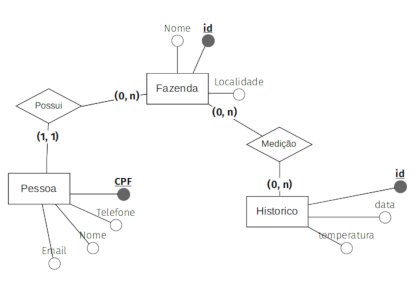
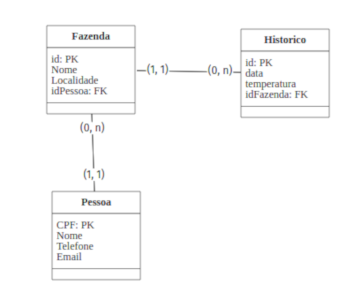

# Solução adotada para o desafio

## Etapas
1. Interpretação, contexto e levantamento de requisitos para o domínio do problema;
    1. Criação de ostras, a temperatura do mar é algo crítico.
    1. Broker MQTT? https://engprocess.com.br/mqtt-broker/ , razoalvemente e em alto nível um sistema de publish-subscriber para notificações.
    1. Separar a fazenda de ostras por (filtros): nome, data, temp, localidade, owner.
1. Mapeamento do domínio do problema para um MER.
    1. 
    1. 
