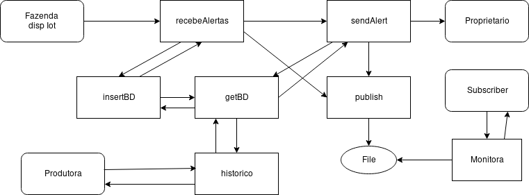

# Solução adotada para o desafio


## Etapas
1. __Interpretação, contexto e levantamento de requisitos para o domínio do problema__
    1. Criação de ostras, a temperatura do mar é algo crítico.
    1. Broker MQTT? https://engprocess.com.br/mqtt-broker/ , razoalvemente e em alto nível um sistema de publish-subscriber para notificações.
    1. Separar a fazenda de ostras por (filtros): nome, data, temp, localidade, owner.
1. __Mapeamento do domínio do problema para um MER.__
    1. 
    1. 
1. __Desenvolvimento da aplicação__
1. __Testes__
1. __Deploy__

## Respostas
1. __Código:__ _OBS: Supondo que bd seja uma função nativa para manipular o banco de dados, supondo que findData é uma função nativa para localizar data em uma string e supondo que a função sendSMS envia um SMS para o número (primeiro paramentro) e a mensagem (segundo parametro)._
```python
# Conecta BD e executa query.
def getBD(query):
    try:
        connection = bd.connect()
        result = connection.execute(query)
        connection.close()
        return result
    except (Exception, error) as error:
        print(Error)

# Insere os dados coletados para o BD.
def insertBD(idFazenda, data, temperatura):
    query = "INSERT INTO Historico (idFazenda, data, temperatura) VALUES (idFazenda, data, temperatura)"
    return getBD(query)
        
# Recebe Alertas do broker MQTT (dispositivo IoT).
def recebeAlertas(data, temperatura, idFazenda):
    result = insertBD(idFazenda, data, temperatura)
    if result is null:
        raiseException("Error, dado não inserido no BD")
    if(temp > 22):
        sendAlert('[CRITÍCO] Temperatura acima de 22°C, STRESS ostras', idFazenda)
    elif(temp > 31):
        sendAlert('[FATAL] Temperatura acima de 31°C, ostras em óbito', idFazenda)
    else:
        publish(idFazenda, '[NORMAL] Temperatura mensurada '+tempetura+'°C')

# Envia Alerta ao proprietário por SMS e publica no arquivo.        
def sendAlert(string, idFazenda):
    findOwner = getBD('SELECT idPessoa FROM Fazenda where id = '+idFazenda)
    query = 'SELECT a.nome, a.telefone FROM Pessoas as a WHERE a.CPF = '+findOwner+'"'
    result = getBD(query)
    sendSMS = (result[1],'Olá Sr. '+result[0]+'A fazenda'+idFazenda+' está com o seguinte alerta: '+string)
    publish(idFazenda, string)

# Publica o alerta em um arquivo monitorado.
def publish(idFazenda, string):
    os.system('echo idFazenda+" "+string >> file')

# Monitora o arquivo.
def monitora(idFazenda, last):
    lastLine = os.system("awk '/./{line=$0} END{print line}' file")
    if idFazenda is in lastLine:
        if findData(lastLine) > data(last):
            raise(Atualização)

# Acessa a tabela historico e retorna os dados conforme o filtro aplicado.
def historico(idFazenda, nome, data, temperatura, localidade, idPessoa)
    query = "SELECT a.nome,a.localidade,b.data,b.temperatura,c.idPessoa FROM Fazenda as a, Historico as b, Pessoa as c WHERE a.id = b.idFazenda and a.idPessoa = c.CPF"
    if idFazenda is not None: query + " and a.idFazenda = "+ idFazenda
    if nome is not None: query + " and a.nome = "+ nome
    if data is not None: query + " and b.data = "+ data
    if temperatura is not None: query + " and b.temperatura = "+ temperatura
    if localidade is not None: query + " and a.localidade = "+ localidade
    if idPessoa is not None: query + " and c.CPF = "+ idPessoa
    return getBD(query)
```

2. __Diagramas de fluxo da aplicação__

__Definições__: Retangulos arredondados são entindades do programa, retangulos são funções do sistema.  
__Descrição__: 
1. Espera-se que tenha um dispositivo IoT capaz de enviar os 3 parametos _(data,temperatura e idFazenda)_ para a função __recebeAlertas__.
1. A função __recebeAlertas__ chama a função __insertDB__ passando os parametros que recebeu para que a função __insertDB__ traduza os parametros em uma query que possa ser executada pelo BD em __getBD__. Que retorna a execução da query no BD. Ainda a função __recebeAlertas__ é responsanvél por fazer uma análise do dado, notificando o proprietário da fazenda __(sendAlert)__ caso apresente alguma anomalia ou publicando o alerta diretamente caso nenhuma anomalia foi encontrada __(publish)__.
1. A função __sendAlert__ é responsavel por localizar o proprietário e executando a query através da função __(getBD)__ e notificar o usuário via SMS, logo apos publicando o alerta.
1. Partimos do pressuposto que um subscriber está executando a função __monitora__ passando como parametro o idFazenda (identificador da fazenda) e uma data da ultima medição computada (last). A função obtem o arquivo  para que ao ter uma modificação no arquivo ele verifique a ultima atualização (ultima linha), verifique se é sobre o idFazenda interessado e verifique com o atual registro que ele possui (last).*
1. A produtora pode consultar e filtrar os resultados através da função __historico__. A função recebe como parametros todos os filtros que ela possa querer utilizar. A execução é simples, basta informar os campos como parametro para a função que se deseja verificar, a função monta a query para executar no banco de dados __(getBD)__ e retorna os resultados para a produtora. O resultado pode ser salvo em um arquivo, exibido no terminal ou passado como object para uma função do FrontEnd.

*: Diversas estratégias podem ser adotadas, como timestamps sobre o protocolo HTTP, ou até mesmo um FTP, etc. Para que ao verificar uma mudança ele baixe o novo arquivo. 

3. __Tecnologias e Motivação__  
__R:__ Possivelmente para esta solução adotaria uma linguaguem dinamicamente tipada como __Python__, pois a curva de desenvolvimento seria rápida e um código de fácil manutenção/leitura.  
Como storage. utilizaria um banco de dados relacional (__PostgreSQL__) visto que o domínio do problema não implica em soluções Big Data. Ainda observando que o fato da temperatura é um dado vital (>31°C) e implicaria em um grande prejuizo, sendo assim, as propriedades ACID evitaria possíveis dados perdidos. 

4. __Ferramentas utilizadas__
Para desenvolvimento deste documento foi utilizado o editor de textos __Pluma__, para os modelos conceituais e lógicos foi utilizado a ferramenta __brModelo__, para o diagrama de fluxo do programa foi utilizado o website __draw.io__.
